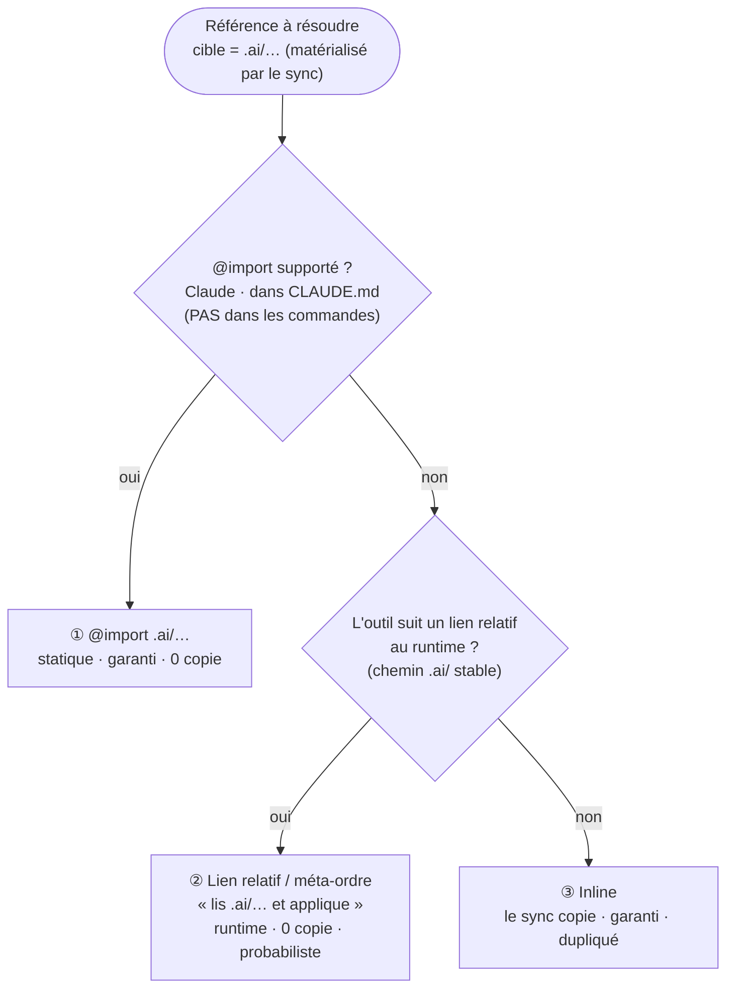

# Lexique — ai-core (vocabulaire pour *développer l'outil*)

> ⚠️ **Ce lexique décrit ai-core *lui-même*, pas l'application cible.** Il vit dans `doc/` **exprès** :
> il ne doit **jamais** migrer dans `conventions/`, sinon le sync l'injecterait dans le `CLAUDE.md` de
> *chaque* projet consommateur — qui n'a que faire de nos « packs », « fragments » ou « adapters ».
>
> *C'est le test de [`conventions/meta/taxonomy.md`](../conventions/meta/taxonomy.md) appliqué à
> lui-même : « si je change de projet, ce terme part-il avec moi ? » → **non** → ce n'est pas du cœur →
> `doc/`.* Le domaine d'un projet cible, lui, vit dans son `.ai/contexts/`. On ne mélange pas les deux mondes.

Raison d'être : on se marchait sur les pieds (« cœur » voulait dire trois choses). **Une maison par terme.**

---

## A. L'application vs la matière

| Terme | Définition | ≠ |
|---|---|---|
| **ai-core** *(l'outil, le paquet)* | L'**application** npm : le `sync` + la matière embarquée. | ❌ « le cœur » |
| **sync** | `tools/sync-ai.mjs` : l'orchestrateur (adaptateur IO + CLI) qui assemble la matière → adapters. La logique pure vit dans `tools/lib/`. | |
| **Adapter** | Fichier **généré** (`CLAUDE.md`, `GEMINI.md`, `.github/*`). Jamais source ; le sync n'en possède qu'un **bloc balisé** (`ai-core:start … end`). | la **zone libre** (à l'humain) |

## B. La matière — deux origines

| Terme | Définition |
|---|---|
| **Cœur** | La source **embarquée & ratifiée** dans le paquet (`conventions/` + `commands/`). **« Cœur » ne désigne plus que ça.** Versionné, ne change que par PR. |
| **Project-local** | La matière **apportée par le projet** sous `.ai/` (`contexts/`, `commands/`). **Opaque** au cœur, hors PR ai-core. |

## C. Le cœur, par couche (agnostique ↔ techno)

| Terme | Définition |
|---|---|
| **Socle** *(agnostique)* | `method + global + meta` : les règles **sans langage**, valables partout. *(= « ce qui est embarqué sans langage spécifique ».)* |
| **Stack** *(langage ou framework)* | `stacks/<techno>.md` : règles **scopées techno** (`applyTo`). A un **`kind`** — *langage* (`typescript`, `csharp`…) **ou** *framework* (`react`, `angular`…) — et **un framework `extends` un langage** (le sélectionner tire le langage ; `applyTo` scope chacun). Facettes : *détection (`detect:`) · convention · fragments de commande*. |
| **Aspect** | Préoccupation **transverse** (testing, security, a11y). **N'est pas une stack.** Reste dans socle/stack tant qu'une friction ne l'émancipe pas. |
| **Context** | Règles d'un **bounded context** précis. **Project-local** (`.ai/contexts/`). Ses règles **architecturales** sont **adossées à un ADR** (qu'il **pointe**, pas recopié). |

## D. Les commandes

| Terme | Définition |
|---|---|
| **Pack** | **Namespace** de commandes par domaine (`git`, `craft`, `tests`…). **Opt-in** (importé seulement si listé dans `commands`). **Agnostique par construction.** Résout la collision **par construction** : `/git:commit` ≠ `/craft:commit`. |
| **Commande** | **Squelette agnostique** (`command.md`) **+** **fragments** additifs. |
| **Fragment** | Le `<stack>.md` d'une commande, **ajouté quand la stack est active** — c'est lui qui porte le **concret techno**. |
| **Complétion guidée** *(1ʳᵉ exécution)* | Au lieu d'un param statique : le fragment fait **découvrir le concret au LLM** (chemins…), **demande confirmation au user**, puis **fige** le résultat en project-local. *Agnostique à la livraison → concret au 1ᵉʳ run → déterministe ensuite.* |

> **Skill ≠ Commande** *(l'axe qui tranche)* : un **skill** est un comportement **TOUJOURS appliqué** (jamais
> invoqué — ex. la délibération, cf. *Skill de base* §E) ; une **commande** est **DÉCLENCHÉE** (tu l'invoques :
> `/check`). **Un truc invocable n'est jamais un « skill ».** *(« skill craft » était un abus de langage → c'est une commande.)*

## E. Cycle de vie d'une règle / d'une commande

| Terme | Définition |
|---|---|
| **Skill de base** | Méthode **toujours active** (la délibération, `conventions/method.md`). **Pas** une commande — sinon elle deviendrait *opt-in*. |
| **Ratifier** | L'IA **propose** une règle (method §6) → l'humain **valide par PR** sur ce repo → bump de version. |
| **ADR** *(Architecture Decision Record)* | La **décision gated** : le *pourquoi* + les **branches tuées** (= la sortie de `method.md §5`). **Épine dorsale** des règles architecturales d'un **context**, qui le **pointe**. Boucle : *délibération → ADR → règle de context → réfuteur (qui cite l'ADR) → friction §6 → nouvel ADR*. **Tout context n'a pas besoin d'ADR** — seulement les règles **architecturales / portes à sens unique**. |
| **Consolidate** | `--consolidate` : rassemble les commandes natives éparpillées (`.claude/commands`, `.github/prompts`) en **une** source neutre `.ai/commands/`. |
| **Orphelin** | Adapter signé `ai-core` mais **plus généré** ce run → le sync le **signale**, ne le **supprime jamais**. |

## F. Références & composition (statique vs runtime)

| Terme | Définition |
|---|---|
| **`@import`** *(statique)* | Directive résolue par l'**outil** au chargement — **Claude seul**. L'adapter *référence* sans copier ; les autres outils → le sync **inline** à la place. |
| **Context-pointeur** *(passif)* | Un context court qui **lie** une source de vérité (doc, ADR…) ; le LLM la lit **à la demande**. Pour le **volatil** (taxonomy : « inline le stable, pointe le volatil »). |
| **Méta-ordre** *(actif, runtime)* | Instruction en langage naturel : « **lis tel fichier ET exécute-le** ». Résolue **au runtime** par le LLM agentique → **marche sur TOUS les outils** (pas que Claude), car ce n'est pas un `@import`. Permet à une **commande d'en composer une autre**. ⚠️ **probabiliste** (pas garanti en contexte) + **chemin valide au runtime requis** (fragile vers le cœur en `node_modules` → réserve-le au **project-local**). *(La complétion guidée **est** un méta-ordre.)* |

> **Règle inline ↔ méta-ordre** : **inline** le *stable + toujours-requis + à garantir* (`method/global/stacks`) ; **méta-ordre** pour le *volatil / conditionnel / la composition project-local*. Jamais de méta-ordre vers le cœur en `node_modules`.

### Cascade de résolution d'une référence — « on utilise ce qu'on a où on peut »

> ⚠️ **Modèle CIBLE — pas encore implémenté.** Aujourd'hui le sync **inline** tout (cf. HOWTO). Ci-dessous la direction visée.

Le sync **matérialisera** le cœur utile dans **`.ai/`** (chemin project-local **stable**, committé) ; `node_modules`
reste la **source**, jamais la cible. Puis, pour chaque référence, il prend le **meilleur mécanisme disponible** :

> **Priorité : ① `@import` › ② lien relatif › ③ inline.** L'axe *garantie* peut **forcer ③** : un contenu
> qui **doit** être en contexte (méthode, constitution) est **inliné**, même si ① / ② serait possible. **③ = filet universel.**
>
> **Zones de `.ai/`** : ce que le sync **matérialise** (regénérable, *ne pas éditer*) doit être **séparé** de
> ce que **tu écris** (`contexts/`, `commands/`) — sinon le sync écrase ta prose.
>
> **Mono-LLM → `.ai/` disparaît.** Le hub neutre `.ai/` ne se justifie que par le **multi-LLM** (1 source → N
> adapters, sans drift). Avec **un seul** LLM, c'est de l'indirection pure → on matérialise/écrit **directement
> dans son dossier natif** (Claude-only → `.claude/` + `CLAUDE.md`). *Exception : une commande **additive**
> (fragments) garde `.ai/commands/` comme **atelier d'assemblage** (source ≠ sortie), même mono-LLM.*

---

> **Règle d'or du lexique** : un terme qui décrit *comment ai-core est fabriqué* → ici (`doc/`).
> Un terme du *domaine d'un projet cible* → le `.ai/contexts/` de ce projet. Deux mondes, deux maisons.
